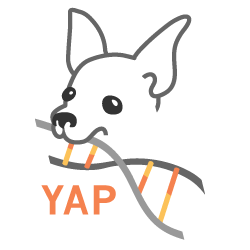

YAP
===
YAP is an extensible parallel framework, written in python using openmpi libraries. It allows researchers to quickly build high throughput big data pipelines without extensive knowledge of parallel programming. The user interacts with the framework through simple configuration files to capture analysis parameters and user directed metadata, enabling reproducible research. Using YAP, analysts have been able to achieve a significant speed up of upto 36x in RNASeq workflow execution times.

# Documentation

* [Quick Tutorial](doc/home.md)
* [Technical Document](doc/yap.pdf)

# Authors

* Vibhas Aravamuthan, Ph.D.
* Tripti Kulkarni
* Varun Shivashankar
* Robin Ge
* Stephen Litster, Ph.D.
* Michael Derby
* Michael Steeves
 
# License

Copyright 2014 Novartis Institutes for Biomedical Research

Licensed under the Apache License, Version 2.0 (the "License");
you may not use this file except in compliance with the License.
You may obtain a copy of the License at

    http://www.apache.org/licenses/LICENSE-2.0

Unless required by applicable law or agreed to in writing, software
distributed under the License is distributed on an "AS IS" BASIS,
WITHOUT WARRANTIES OR CONDITIONS OF ANY KIND, either express or implied.
See the License for the specific language governing permissions and
limitations under the License.
